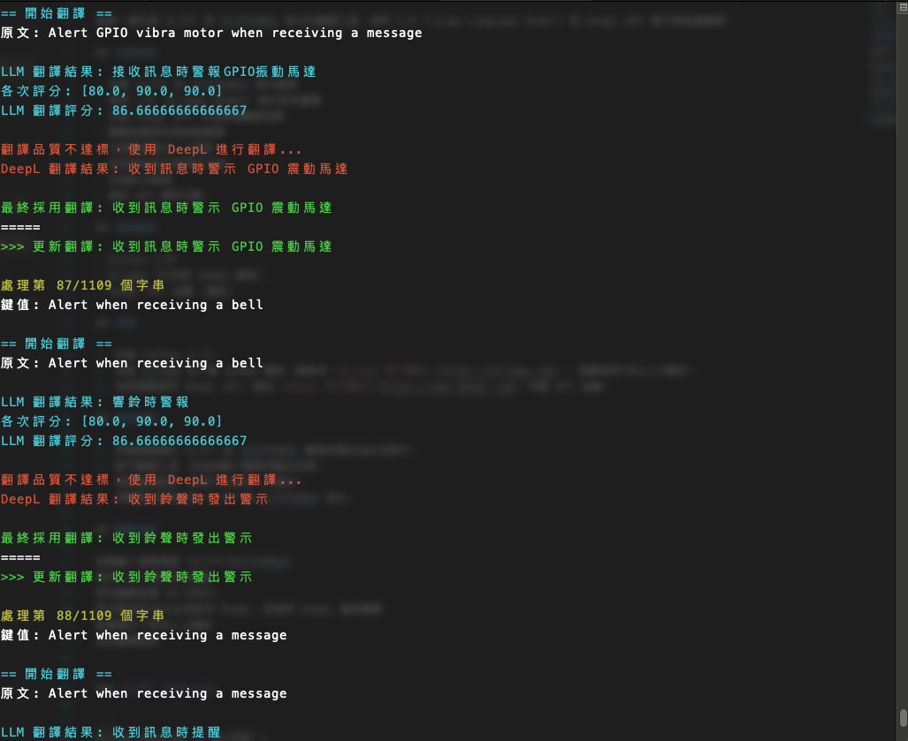

# XLIFF 與 XCSTRINGS 翻譯工具

這是一個支援 XLIFF 和 XCSTRINGS 格式的翻譯工具，使用 LLM (Large Language Model) 和 DeepL API 進行高品質翻譯。

## 功能特色

- 支援 XLIFF 和 XCSTRINGS 格式檔案
- 使用 LLM (Ollama Gemma) 進行初步翻譯
- 支援 DeepL API 作為備選翻譯服務
- 翻譯品質評估與自動選擇
- 支援監督模式人工審核
- 保持原始格式與標記不變
- 支援批次處理
- 統計 API 調用次數

## 系統需求

- Python 3.8+
- Ollama (已安裝 Gemma 模型)
- DeepL API 金鑰 (選配)

## 安裝

1. 安裝 Python 3.11。
2. 安裝 Ollama 並下載 Gemma 模型，請參考 [Ollama 官方網站](https://ollama.com)。 推薦使用7B以上大模型。
3. 如果需要使用 DeepL API，請從 [DeepL 官方網站](https://www.deepl.com) 申請 API 金鑰。

## 使用說明

1. 將需要翻譯的 XLIFF 或 XCSTRINGS 檔案放置在指定目錄中。
2. 執行翻譯工具，並指定輸入檔案和輸出目錄。
3. 檢查翻譯結果，並進行必要的人工審核。
4. 將翻譯結果匯出為 XLIFF 或 XCSTRINGS 格式。

## 翻譯流程

檢測輸入檔案類型（XLIFF/XCSTRINGS）
使用 LLM 進行初步翻譯
評估翻譯品質（0-100分）
若分數低於90分且有啟用 DeepL，則使用 DeepL 重新翻譯
監督模式下等待人工確認
保存翻譯結果


### XLIFF (Android)

```
python main.py -t ZH-HANT \
-i ./xliff/Meshtastic.xliff \
-d "MESH LORA 無線網路 iot節點" \
-all -deepl --deepl-key <YOUR_DEEPL_KEY>
```

output:
```
Meshtastic_ZH-HANT_202403151430.xliff
```

### xcstrings(iOS)

```
python main.py -t ZH-HANT \
-i ./xcstrings/Localizable.xcstrings \
-d "MESH LORA 無線網路 iot節點" \
-all -deepl --deepl-key <YOUR_DEEPL_KEY>
```

output:
```
Localizable_ZH-HANT_202403151430.xcstrings
```

### 參數說明

- -t, --target-lang: 目標語言（例如：ZH-HANT）
- -i, --input: 輸入檔案路徑
- -d, --domain: 翻譯領域，有助於提高專業術語翻譯準確度
- -all: 重新翻譯所有內容，包括已翻譯項目
- -supervised: 開啟監督模式，每次翻譯需人工確認
- -deepl: 啟用 DeepL API 作為備選翻譯
- --deepl-key: DeepL API 金鑰